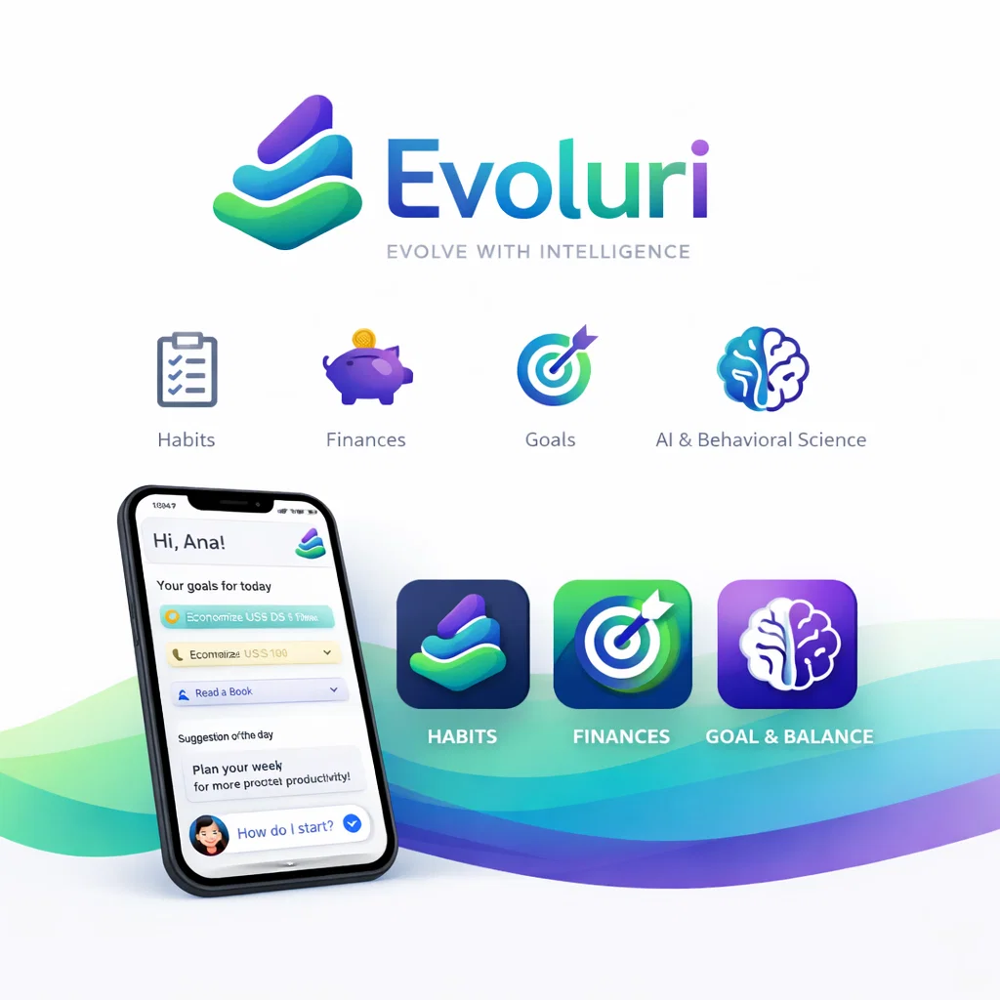

# nexar
an intelligent agent

# this app performs the following tasks:

- converses with the user
- learns from interactions
- suggests routines and habits
- manages personal finances
- tracks goals and projects
- writes your own autobiography
- protects emotionally vulnerable users

it functions as:

assistant + Mentor + Integrated Life System

# example evoluri (company brandbook)

